# Human Debris Archive

This project is an archive of the Human Debris project, a collection of maps, mods, and programs developed by Jason Brownlee for the computer game Quake III Arena between 1999 and 2001 (first few years of university).

The website was hosted on `http://zygote.alphalink.com.au/humadebris/` and then moved to `http://planetquake.com/humandebris`.

There was also work on hacking bots into the Q3Test on `http://geocities.com/q3bots`, e.g. [here](https://groups.google.com/g/alt.games.quake3/c/ccjVDoyjZ84/m/ElB0HqBI3GcJ), but I think it has all been lost.

There was also programming work on a Unreal Tournament to Quake 3 total conversion on `http://www.planetquake.com/meanarena/UT_2_Q3.html` that also seems to be lost.

Additionally, two articles were written on AI game development for `http://ai-depot.com` and are also included in this archive.

There is also a scan of an article in PCPowerplay magazine about one of the mods.

## Project Directories

* [`humandebris`](humandebris/) Contains a dump of the `http://planetquake.com/humandebris` files captured by the internet archive.
* [`humandebris-files`](humandebris-files/) Contains a backup of the map, mod, and program files from the human debris website.
* [`ecosystem`](ecosystem/) Contains the files for an article on AI development in Quake 2 for a writing competition.
* [`finitestatemachines`](finitestatemachines/) Contains the files for an article on AI development in Quake for a writing competition.
* [`pcpowerplay`](pcpowerplay/) Scan of an article from PCPowerplay magazine issue 52 on page 20.

## Human Debris Files

Summary of the main files developed for the Human Debris project.

### Quake 3 Arena Maps

* [Bairnsdale Q3](humandebris-files/maps/bdaleq3.zip). I made this map way back when I used to play with the Half-Life editor. The map is based on real house that my friend owns. On his request I converted it to Quake3 in early 2000. Since then I forgot all about it until now. I think it suits Half-Life a lot better both in game play and textures. Still its a lot of fun with a few bots.
* [Death From Above](humandebris-files/maps/dfa.zip). This is a small Deathmatch map play's very fast in 1v1 games, and becomes a total blood bath in FFA. The zip contains a readme with installation instructions.
* [Railme](humandebris-files/maps/railme.zip). This is a really small map made to test the "target_give" entity. As it turns out, it is pretty damn fun :) All bots/players spawn with a fully stocked railgun ready to do some fraggin'. There is a disc thing in the middle, that gives you health and armour every half-a-second.
* [Rocketme](humandebris-files/maps/rocketme.zip). This is the same map as the "railme" map. On a request, I have changed it so that rocket launches are given instead of railguns. As you can see the sky texture has also changed. Just like the "railme" map, this level has a slightly lower gravity as to make the blood and gibs travel further.
* [Duck 'n Cover](humandebris-files/maps/dnc.zip). This is another small map. It is designed for 4-6 FFA match or a 1v1 Tournament. The map has a number of jump pads, and a rail tower in the middle. The bots like to camp up on the tower sometimes :)
* [2Kool](humandebris-files/maps/2kool.zip). This is a small DeathMatch map that can be used for either 1v1 tournament or a Blood Bath with 4-5 Bots. The zip contains a TXT file with installation instructions.

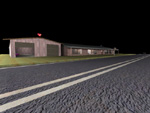
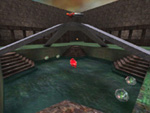
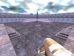
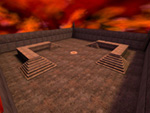
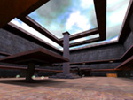
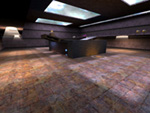

### Quake 3 Arena Mods

* [Sog's Rifle](humandebris-files/mods/sog1.1.zip). All players have a high power rifle, with very low amount of ammunition. This is a game of skill where every shot counts. SOG's Rifle has new sounds and models. The modification works with all maps, bot's and all styles of Q3 game play.
* [I Love Rockets](humandebris-files/mods/I-Love-Rockets1.1.zip). All players spawn into the level with a Rocket Launcher and unlimited ammunition. When you die you do not drop a weapon. There are 5 different Rocket Launchers to choose from, including; Classic Q3 Rocket, Rockets effected by gravity, Homing rockets, Rapid fire rockets and Laser Guided(Half-Life style). This modification is server side.
* [2D Platform Game](humandebris-files/mods/q3pg1.0.zip). This modification transforms Q3:Arena into an old style 2D platform game. The mod includes one example map and supports bots. Third-party maps for the mod:
	* Cyber Escape [cyber1.zip] By Thearrel "Kiltron" McKinney
	* Led Platmaps [led-platmaps.zip] By Frederik Charest
	* Q3-2D-dm1 [q3-2d-dm1.zip] By Matt "Mista T." Tropiano
* [One Shot Kills (OSK)](humandebris-files/mods/osk1.1.zip). OSK stands for One Shot Kills. OSK:Arena is basically a mod that is based on Unreal Tournaments Instagib style of game play. The modification actually includes TEN different versions of instagib, selectable via a menu system. These include: Classic, Rifle, Bouncing, Telefrag, Gauntlet, Delayed(Classic), Delayed(Jump 'n Gib), Delayed(Invisible), Delayed(Haste), and Delayed(Blast).
* [Telefrag Railgun](humandebris-files/mods/telefrag.zip). This modification changes the railgun so that when it is fired at another player the player doing the firing telefrags the target. Telefragging other players means that players a always moving around, which makes the game play very fast and furious. Camping with a railgun is no longer an option.

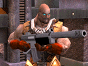
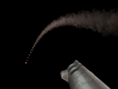
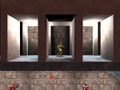
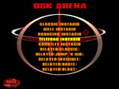

### Quake 3 Arena Tutorials

* **Telefrag Gun**. Modify the railgun so when you shoot another player, instead of killing them, you will teleport to where they are standing, hence telefrag them. This makes the railgun a lot more fun to use, and creates one hell of an anti camper / anti sniper feature.
* **Guided Rockets**. If you have ever played Half-Life, then the concept should be familiar. Think of your crosshair as a laser pointer. Once a rocket is fired, where ever you point your crosshair, the rocket will head in that direction. The result of this tutorial is a rocket launcher similar to the one in Half-Life (not exactly the same though).
* **Kamikaze Key**. Everybody knows the "kill" console command, where when it is issued the player will instantly commit suicide on the spot, and loose a frag. This tutorial takes the "kill" command one step further, where the player will not only suicide, but will go with a blast that will take other players with them.
* **Sticky Grenades**. This is a very short and simple tutorial. In Quake3, when a grenade hits something that cannot be damaged, it will bounce off. Change the grenade launcher so that instead of bouncing, grenades will stick.
* **Jump and Gib Gun**. Modify the railgun so when you shoot another player, instead of killing them straight away, the target will by thrown up in the air and then gib, hence the Jump and then Gib.
* **Alternate Weapons Fire**. Alternate Fire means have a secondary fire button. This feature is common in other FPS games like Unreal Tournament and Half-Life. This tutorial will will take you through the steps involved in adding alternate fire to your Quake3 modification.

### Quake 3 Arena Java Programs

* [Server Query Tool](humandebris-files/software/ServerQueryTool.zip). This is a simple application to query Quake3:Arena servers. There are three queries you can perform on a server: a "Ping" (gamespy style), a "getInfo" (Basic information) and a "getStatus" which contains heaps of info including a list of all the players currently connected along with their ping and frag score. A picture of the current map being played is also displayed.
* [Server Browser Tool](humandebris-files/software/ServerBrowserTool.zip). This is a simple application that allows you to add/delete and import/export a list of Quake3:Arena servers. The program allows you to then query the list of servers to determine the ping, current map being played, number of clients and the type of game being played.
* [Fun Name Maker](humandebris-files/software/FunName.zip). This is a very simple tool to make fun names for Quake3:Arena. You enter your string in the field down the bottom and click "Process". Your colorful name will then appear in the center.

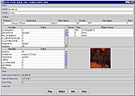
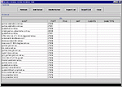
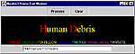

## Quake AI Writing

* Finite State Machines (FSM) in the computer game Quake, AI-Depot Writing Competition (1st place), June 2002. ([archived](https://web.archive.org/web/20040625214646/http://ai-depot.com/FiniteStateMachines/))
* Ecosystem: Constructing a simple self-perpetuating society of adaptable agents. aAlife simulation in the computer game Quake2, AI-Depot Writing Competition, April 2003. ([archived](https://web.archive.org/web/20080624004102/http://www.ict.swin.edu.au/personal/jbrownlee/other/ecosystem/index.html))

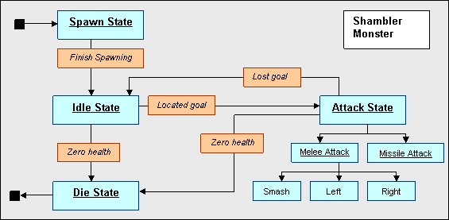
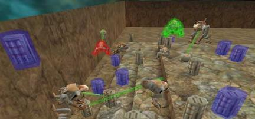

## PCPowerPlay Magazine

Scan of article in PCPowerplay magazine issue 52 on page 20.

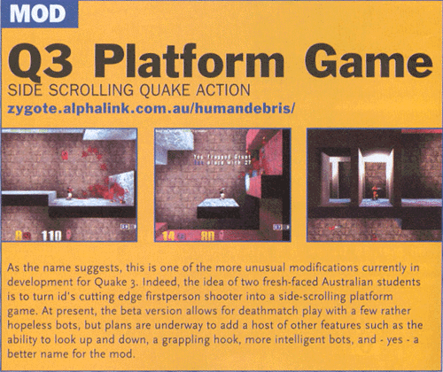

## Internet Archive

Relevant off-site archives of the same material.

* [http://planetquake.com/humandebris](https://web.archive.org/web/20021219012452/http://planetquake.com/humandebris/) (internet archive)
* [http://ai-depot.com/FiniteStateMachines/](https://web.archive.org/web/20040625214646/http://ai-depot.com/FiniteStateMachines/) (internet archive)
* [http://www.ict.swin.edu.au/personal/jbrownlee/other/games/index.html](https://web.archive.org/web/20080616100616/http://www.ict.swin.edu.au/personal/jbrownlee/other/games/index.html) (internet archive)
